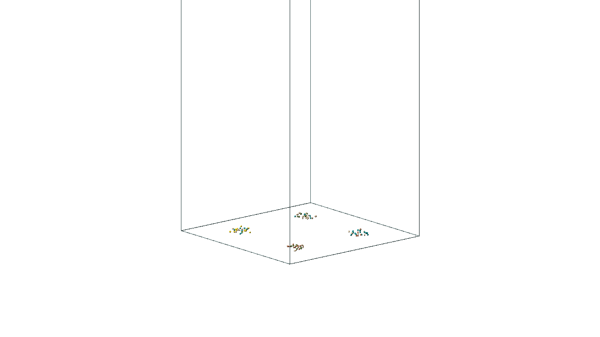
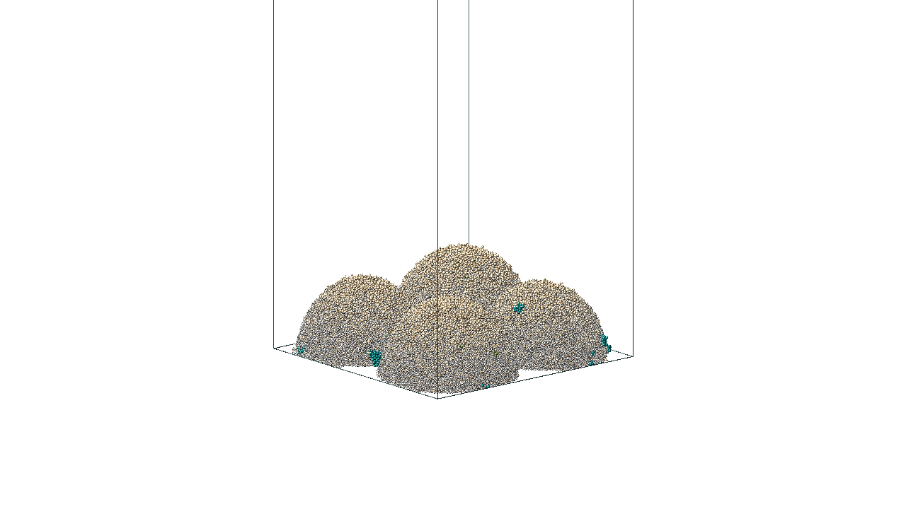
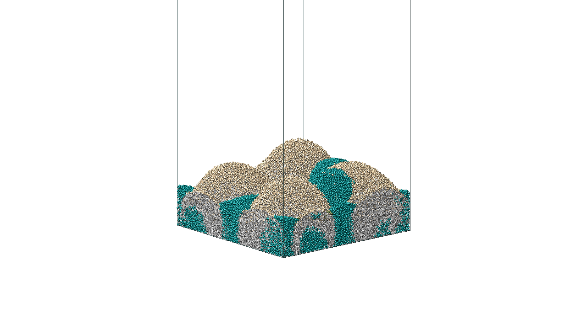

# Mercury Reef

Simulating heavy metal bioremediation in a multi-species biofilm using individual-based modeling.

 |  | 

*Left to right: Day 0 (111 seed cells), Day 68 (merged multi-lobe reef), Day 157 (mature reef with CECT eruption zones)*

## What This Is

A 157-day computational simulation of a microbial biofilm remediating mercury(II) thiocyanate -- a toxic compound found in gold mining wastewater. Every sphere represents an individual bacterium modeled with its own metabolism, growth kinetics, and physical interactions. Every frame is the output of a physics-based simulation where nearly two million virtual microorganisms compete, cooperate, divide, and die according to biochemical rules that govern real biofilms.

This is an exploratory computational experiment, not a validated predictive model. The microbial consortia is hypothetical -- these organisms do not naturally co-occur in a single biofilm. Parameters are order-of-magnitude estimates from published literature, not calibrated to a specific experimental system. But the underlying physics and biology are grounded in established science, and the emergent dynamics were not pre-programmed.

## The Problem

Gold extraction using cyanide leaching produces wastewater containing thiocyanate (SCN-) and mercury (Hg2+). Mercury is one of the most toxic heavy metals in the environment -- it bioaccumulates through food chains, damages neurological systems, and persists in ecosystems for decades. Bioremediation using living organisms offers a sustainable alternative to conventional chemical treatment, but designing effective microbial communities for mercury remediation requires understanding how different species interact in three-dimensional space under toxic stress.

## The Species

Five functional microbial groups are seeded in four asymmetric clusters on a flat substratum inside a 400 x 400 x 800 micrometer virtual reactor:

| Color | Species | Role |
|-------|---------|------|
| **Tan** | Heterotrophs (HET) | Structural backbone. Consume organic carbon, secrete EPS matrix |
| **Dark Olive Green** | Ammonia-Oxidizing Bacteria (AOB) | Nitrifiers. Convert NH4+ to NO2- |
| **Sienna** | Nitrite-Oxidizing Bacteria (NOB) | Nitrifiers. Convert NO2- to NO3-. Went extinct in this run |
| **Gold** | Anammox (ANA) | Convert NH4+ + NO2- to N2 anaerobically. Extremely Hg-sensitive. The "prey" |
| **Teal** | *P. pseudoalcaligenes* CECT5344 | Degrade SCN-, accumulate Hg2+. The mercury "protector" |
| **Wheat** | EPS | Extracellular polymeric substance. Structural scaffolding secreted by HET |
| **Dark Gray** | Dead cells | Starved, poisoned, or shrunk below minimum viable diameter |

## What Emerged (157 Simulated Days)

**Days 1-30:** Four tiny clusters sprout and expand as hemispheres. Heterotrophs undergo explosive growth. EPS scaffolding appears. Colony boundaries are still separated.

**Days 30-60:** Colonies merge. HET hits carrying capacity (~100k cells). NOB goes extinct -- outcompeted. First dead cells appear in the colony interior as basal cells are cut off from nutrients.

**Days 60-100:** The necrotic core grows rapidly. Mercury diffusing from above suppresses anammox to just 12 survivors. CECT begins its lag-phase expansion.

**Days 100-157:** CECT explodes from 2,000 to 82,000 cells. Teal patches erupt through the biofilm surface. HET declines from 100k to 65k as CECT competes for space. AOB recovers slightly, possibly fed by NH4+ from CECT's SCN- degradation. Dead cells reach 90% of total particles -- a realistic necrotic core.

None of this was programmed. It is emergent behavior from Monod kinetics + DEM mechanics + reaction-diffusion PDEs on 8 coupled substrates.

### Key Numbers

| Metric | Value |
|--------|-------|
| Domain size | 400 x 400 x 800 um |
| Grid resolution | 12.5 um (32 x 32 x 64 cells) |
| Simulated time | 157 days |
| Biological timestep | 1 hour |
| Total particles at final frame | 1,872,054 |
| Living cells at final frame | ~148,000 |
| Dead cells at final frame | ~1,682,000 |
| Chemical substrates | 8 (organic C, NH4+, O2, NO2-, NO3-, N2, Hg2+, SCN-) |
| Simulation wall time | ~41 hours (4 MPI ranks) |

## How It Works

**[NUFEB-2](https://github.com/nufeb/NUFEB-2)** (Newcastle University Frontiers in Engineering Biology) is an open-source individual-based model for simulating microbial communities, built on top of **[LAMMPS](https://lammps.org)** (Large-scale Atomic/Molecular Massively Parallel Simulator), the molecular dynamics engine developed at Sandia National Laboratories.

Each microorganism is a spherical particle with:

- **Monod growth kinetics** -- growth rate depends on local substrate concentrations: `mu = mu_max * [S] / (Ks + [S])`. Anammox includes non-competitive Hg2+ inhibition: `mu_eff = mu * K_I / (K_I + [Hg2+])`
- **Discrete element mechanics (DEM)** -- Hertzian contact forces, viscous damping, EPS-mediated adhesion. Cells divide when they reach a threshold diameter
- **Reaction-diffusion on an Eulerian grid** -- 8 substrates diffuse and react on a 3D grid with Dirichlet boundary conditions at the top surface (simulating a well-mixed bulk liquid)
- **EPS secretion** -- heterotrophs allocate a fraction of growth to an outer EPS shell, which is ejected as a structural particle when it exceeds a threshold thickness

### Custom NUFEB Fixes

Two custom growth fixes were written for this project:

- `fix_growth_anammox_hg` -- modified anammox growth with non-competitive Hg2+ inhibition term
- `fix_growth_cect5344` -- SCN- degradation with coupled Hg2+ uptake and NH4+ production

## Rendering

Raw simulation output: VTK files (`.vtu` particle data, `.vti` grid concentrations) produced by NUFEB's dump commands.

**LAMMPS built-in renderer** (`dump image`) produces the preview frames shown above -- SSAO ambient occlusion, fixed camera, 1280x720.

**Blender Cycles** (included Python import script) produces publication-quality renders:
- Geometry Nodes for efficient sphere instancing at 1.9M particles
- Principled BSDF materials with subsurface scattering on living cells
- EPS rendered with SSS + transmission (translucent wet gel, IOR 1.33)
- Dead cells rendered matte (dry, opaque) for viability contrast

## Repository Structure

```
hg_bioremediation/
  src/
    fix_growth_anammox_hg.cpp/.h    # Custom anammox + Hg inhibition fix
    fix_growth_cect5344.cpp/.h      # Custom SCN degrader + Hg uptake fix
  simulations/
    tier1_anammox_hg/
      inputscript.nufeb              # Tier 1: anammox + Hg inhibition only
    tier2_multspecies/
      inputscript.nufeb              # Tier 2: baseline multi-species
      inputscript_mercury_reef.nufeb # Mercury Reef: 365-day showcase (ran 157 days)
      inputscript_tuned.nufeb        # Tuned parameters, 60-day run
      inputscript_morphology.nufeb   # Sparse seeding morphology study (90-day)
      inputscript_morphology_180d.nufeb
      mercury_reef/
        inputscript_early_growth.nufeb  # High-res VTK for early growth animation
  scripts/
    mercury_reef_blender.py          # VTU-to-Blender import + Geometry Nodes + materials
  examples/
    day_0.png                        # LAMMPS-rendered: 111 seed cells
    day_68.png                       # LAMMPS-rendered: merged multi-lobe reef
    day_157.png                      # LAMMPS-rendered: mature reef with CECT eruptions
  dream_biofilm_sim.md               # Future design: optimized dream simulation
```

## Dependencies

- **NUFEB-2** ([github.com/nufeb/NUFEB-2](https://github.com/nufeb/NUFEB-2)) -- built on LAMMPS stable 23Jun2022
- **OpenMPI** -- parallel execution
- **Blender 4.0+** -- for Cycles rendering (optional)
- **VTK 7.1** -- for VTK dump support (built into NUFEB with `--enable-vtk`)

### Building NUFEB with the custom fixes

```bash
# Clone NUFEB-2
git clone https://github.com/nufeb/NUFEB-2.git
cd NUFEB-2

# Copy custom fixes into the NUFEB source
cp /path/to/hg_bioremediation/src/fix_growth_anammox_hg.* lammps_stable_23Jun2022/src/NUFEB/
cp /path/to/hg_bioremediation/src/fix_growth_cect5344.* lammps_stable_23Jun2022/src/NUFEB/

# Build
./install.sh --enable-vtk
```

### Running a simulation

```bash
mpirun -np 4 /path/to/nufeb_mpi -in inputscript_mercury_reef.nufeb
```

## Open Hypothesis

CECT colonies may create local Hg2+ depletion zones -- "mercury shadows" -- where anammox bacteria can survive despite bulk mercury concentrations that would otherwise be lethal. This spatial co-localization represents a form of niche construction mediated by the EPS matrix, which retards Hg2+ diffusion. Testable in silico (distance-dependent ANA survival analysis) and experimentally (FISH microscopy + Hg microelectrode profiling).

## References

1. Li, B. et al. (2019). "NUFEB: A massively parallel simulator for individual-based modelling of microbial communities." *PLOS Computational Biology.* [doi:10.1371/journal.pcbi.1007125](https://doi.org/10.1371/journal.pcbi.1007125)
2. Luque-Almagro, V.M. et al. (2005). "Bacterial degradation of cyanide and its metal complexes under alkaline conditions." *Applied and Environmental Microbiology.*
3. Strous, M. et al. (1999). "Missing lithotroph identified as new planctomycete." *Nature.*

## License

MIT
